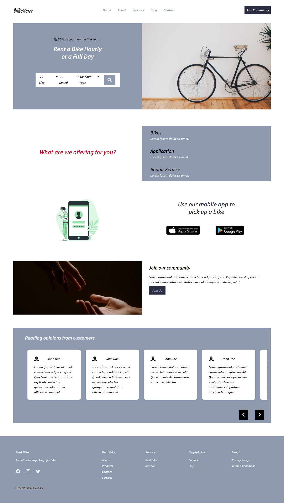

<div id="top"></div>

[![Contributors][contributors-shield]][contributors-url]
[![Forks][forks-shield]][forks-url]
[![Stargazers][stars-shield]][stars-url]
[![Issues][issues-shield]][issues-url]
[![License][license-shield]][license-url]


<br />
<div align="center">


  <h3 align="center">COALS</h3>

  <p align="center">
    A web application to facilitate the sale of bags of coal.
    <br />
    <a href="https://github.com/charbossly/Rent-Bike"><strong>Explore the docs »</strong></a>
    <br />
    <br />
    <a href="https://charbossly.github.io/Rent-Bike/">View Demo</a>
    ·
    <a href="https://github.com/charbossly/Rent-Bike/issues">Report Bug</a>
    ·
    <a href="https://github.com/charbossly/Rent-Bike/issues">Request Feature</a>
  </p>
</div>


<!-- TABLE OF CONTENTS -->
<details>
  <summary>Table of Contents</summary>
  <ol>
    <li>
      <a href="#about-the-project">About The Project</a>
      <ul>
        <li><a href="#built-with">Built With</a></li>
      </ul>
    </li>
    <li>
      <a href="#getting-started">Getting Started</a>
      <ul>
        <li><a href="#prerequisites">Prerequisites</a></li>
        <li><a href="#installation">Installation</a></li>
      </ul>
    </li>
    <li><a href="#contributing">Contributing</a></li>
    <li><a href="#license">License</a></li>
    <li><a href="#contact">Contact</a></li>
  </ol>
</details>


<!-- ABOUT THE PROJECT -->
## About The Project

[


### Built With


* [Html]
* [Css]
* [Tailwind Css](https://tailwindcss.com/)
* [JavaScript]

<p align="right">(<a href="#top">back to top</a>)</p>


<!-- GETTING STARTED -->
## Getting Started

### Prerequisites

* npm
  ```sh
  npm install npm@latest -g
  ```

### Installation


1. Clone the repo
   ```sh
   git clone https://github.com/charbossly/Rent-Bike.git
   ```
2. Install NPM packages
   ```sh
   npm install
   ```
3.  Run using Tailwind CSS
      ```sh
        npm run dev
      ```

OTHERS
4.  Build using Tailwind CSS
    ```sh
        npm run build
     ```

5.  Open the `public > index.html` file in your browser and you should see a heading styled with a gradient. If you don't see a gradient on the text, something went wrong.

-   Go to `public > index.html` Remove the `<h1>` element and start adding your own HTML.
-   If you need to add more HTML pages, add them in the `public` folder.
-   To extract classes and use the `@apply` directive, edit the custom CSS file in `src > styles.css`. Add any amount of custom CSS within this file. Refer [https://tailwindcss.com/docs/installation#using-a-custom-css-file](https://tailwindcss.com/docs/installation#using-a-custom-css-file)

Watch HTML files for changes and build automatically everytime using
 ```sh
    npm run watch
```

NOTE: Do NOT edit the file `public > dist > styles.css` directly - This is the distribution stylesheet. The CSS here is generated from `src > styles.css` using Tailwind when you build.

Before pushing your code (the `public` folder) for production, run the below command to reduce the size of `styles.css` within the public folder
```sh
     npm run prod
```
NOTE: If you are using Windows and face an error `NODE ENV not recognised`, run the below command

     npm install win-node-env


<p align="right">(<a href="#top">back to top</a>)</p>


<!-- CONTRIBUTING -->
## Contributing


If you have a suggestion that would make this better, please fork the repo and create a pull request. You can also simply open an issue with the tag "enhancement".
Don't forget to give the project a star! Thanks again!

1. Fork the Project
2. Create your Feature Branch (`git checkout -b feature/AmazingFeature`)
3. Commit your Changes (`git commit -m 'Add some AmazingFeature'`)
4. Push to the Branch (`git push origin feature/AmazingFeature`)
5. Open a Pull Request

<p align="right">(<a href="#top">back to top</a>)</p>


<!-- LICENSE -->
## License

See `LICENSE.txt` for more information.

<p align="right">(<a href="#top">back to top</a>)</p>


<!-- CONTACT -->
## Contact

- Github - [CharbelAssogba](https://github.com/charbossly) - assoogbacharbossly@gmail.com
- Twitter - [@assogba_charbel](https://www.twitter.com/assogba_charbel
- Project Link: [https://github.com/charbossly/Coals](https://github.com/charbossly/Rent-Bike)

<p align="right">(<a href="#top">back to top</a>)</p>


<!-- MARKDOWN LINKS & IMAGES -->
<!-- https://www.markdownguide.org/basic-syntax/#reference-style-links -->
[contributors-shield]: https://img.shields.io/github/contributors/charbossly/Coals.svg?style=for-the-badge
[contributors-url]: https://github.com/charbossly/Coals/graphs/contributors
[forks-shield]: https://img.shields.io/github/forks/charbossly/Coals.svg?style=for-the-badge
[forks-url]: https://github.com/charbossly/Coals/network/members
[stars-shield]: https://img.shields.io/github/stars/charbossly/Coals.svg?style=for-the-badge
[stars-url]: https://github.com/charbossly/Coals/stargazers
[issues-shield]: https://img.shields.io/github/issues/charbossly/Coals.svg?style=for-the-badge
[issues-url]: https://github.com/charbossly/Coals/issues
[license-shield]: https://img.shields.io/github/license/charbossly/Coals.svg?style=for-the-badge
[license-url]: https://github.com/charbossly/Coals/blob/master/LICENSE.txt
[product-screenshot]: ./screenshot.png